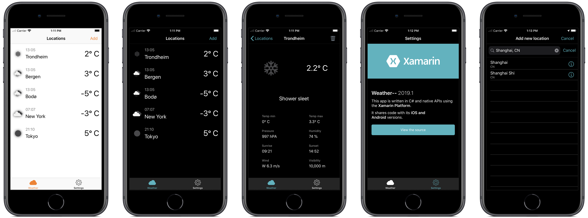

# Weather--



## An app showcasing GraphQL with ASP.Net Core 3 and Xamarin Forms

This is an educational repository showcasing a GraphQL API consumed by a Xamarin Forms app. This repository can be used as a template for:

- a modern Xamarin Forms 4.3 app with clean and testable architecture consuming a GraphQL endpoint
- an Asp.Net Core 3 GraphQL server in front of the [OpenWeather](https://openweathermap.org) APIs

The API can be explored on [https://graphql-weather.azurewebsites.net/ui/playground](https://graphql-weather.azurewebsites.net/ui/playground).

The code uses some of the new features of C# 8, such as nullable reference types.

I've given a presentation on modern Xamarin Forms and this repo in particular at a local .Net User Group meeting, and you can view the slides below:

<script async class="speakerdeck-embed" data-id="76f56db5a1974e1bbb35a67ff926d440" data-ratio="1.77777777777778" src="//speakerdeck.com/assets/embed.js"></script>

## Run locally

The apps needs a tiny bit configuration before running locally:

### The server

The server needs an *OpenWeather API key*, which is available for free on [openweather.org](https://openweathermap.org). This key must be set as an environment variable or present in `appsettings.json` for the server to run:

```shell
OpenWeatherConfiguration__ApiKey="[APIKEY]"
```

To run the server after configuration is in place, navigate to the `/src/API/GraphQLDotNet.API`-folder, and run:

```shell
dotnet run
```

### The apps

The apps need the *address of the server* and optionally an *AppCenter secret*, for iOS and/or Android, to use crash reporting and analytics in AppCenter. These must be specified in a `secrets.json` file present at the root of the `src/Mobile/GraphQLDotNet.Mobile` project. This file is ignored by Git.

If the server is running locally, you can use:

```json
{
  "ApiBaseAddress": "localhost",
  "AppCenteriOsSecret": "",
  "AppCenterAndroidSecret": ""
}
```

Then either `GraphQLDotNet.Mobile.Android` or `GraphQLDotNet.Mobile.iOS` can be run from Visual Studio.
